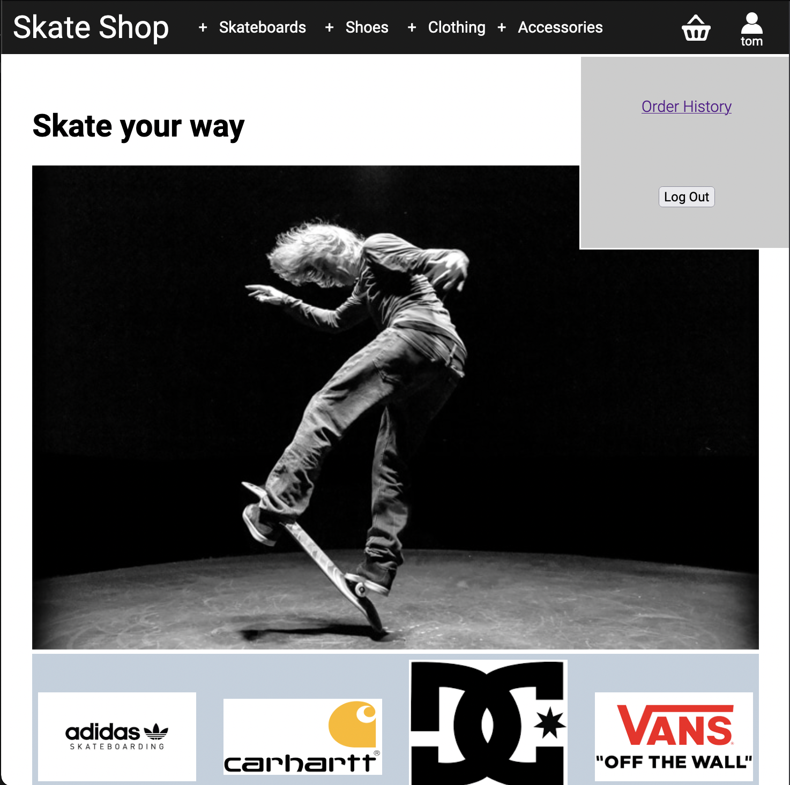

# Skate shop 

 
 

# Function
Skate Shop is a CRUD web application built with PHP, jquery, CSS, and MySQL.

It replicates a user shopping experience on an e-commerce skate shop

As a user, you can:
- Create an account
- Login/logout of your account
- Browse products by sub-category via menus
- Add products to your basket (if there are enough items in stock)
- Checkout to ‘purchase’ the items in your basket
- Review your order history

 
 

# Database
The application uses a relational database with the following tables:
- User
- Brand
- Category
- Sub-category
- Products
- Basket
- Order history

The tables use primary key / foreign key relationships to reduce repetition in the database. The structure of the database is shown in the diagram below:

 
 

# Create Account
Users can create an account by providing a username and password. If the passwords match, the user information is inserted into the user table in the database. The site then automatically sets the super global session variable with the user credentials (i.e. logs the user in), and redirects them to the home page.

 
 

# Login/Logout
If the user already has an account, they can sign in via a form that drops down when the profile icon in the nav bar is clicked. If they provide incorrect credentials an alert is shown advising them to check their username and password. If signed in, their user name is displayed under the profile icon, otherwise it shows ‘guest’.

 
 

# Navigation

The navigation bar is responsive to screen size. In mobile view, the list of categories appears as a dropdown toggle button:

 

In desktop view, the categories appear in the nav bar:

 

Each category also has sub-categories, with appear as a dropdown in both mobile or desktop view when the category is clicked.

The categories and subcategory titles are populated from the database tables, meaning you can add, delete and update categories in the database and the changes will occour on the website automatically.

 
 

# Product Lists
Clicking on a subcategory will take you to a product list page, displaying the products within the subcatetory. The list is also reactive, utilising CSS grid and javascript to adjust the number of column and the height of each products.

 
 

# Product Item

When you click on a product in the product list, you are redirected to that product’s item page.

The item page shows the current stock level of the products and an ‘add to basket’ button.

 
 

# Stock Levels
If the product is out of stock, a message will say so and the ‘add to basket’ button will be deactivated.

 If you try to add more to your basket than is in stock, an alert will tell you that you cannot add anymore, and no more of this item will be added to your basket.

 
 

# AJAX and Basket
When you add items to your basket the information is added to the basket table in the database. The page is also updated using AJAX, so the page doesn’t need to reload to show the most up to date information.

The basket count, and the item in the basket dropdown are both updated asycnorynisly without the need to make a new request to the server and reload the entire page. 

 

You can also update the quantity or delete the item from the dropdown basket display or from the basket summary page. The total price, or presence in the basket, is again updated in the database and the page is updated with AJAX to avoid having to reload the whole page.

 
 

# Confirm Purchase

When the user clicks the “confirm purchase” button,  the item is added to the “order history” table.

An alert is displayed to show that the purchase has been successful

 
 

The user is then redirected to the Order History page.

 
 
Each entry to the order history page is a clickable link that takes the user to a summary of that order.
 

 
 

# Installation 

This application runs on MAMP (or equivalent server solution for your device). The “skateshop” folder should be saved in the htdocs folder.
 

 
The database should be saved under the db > mysql57 folder in MAMP 	
 

 

Once the files are in the right place, just click “start” on the MAMP interface to start the server.

 

 

Then enter the URL in your browser:

http://localhost:8888/skate_shop/views/index.php
